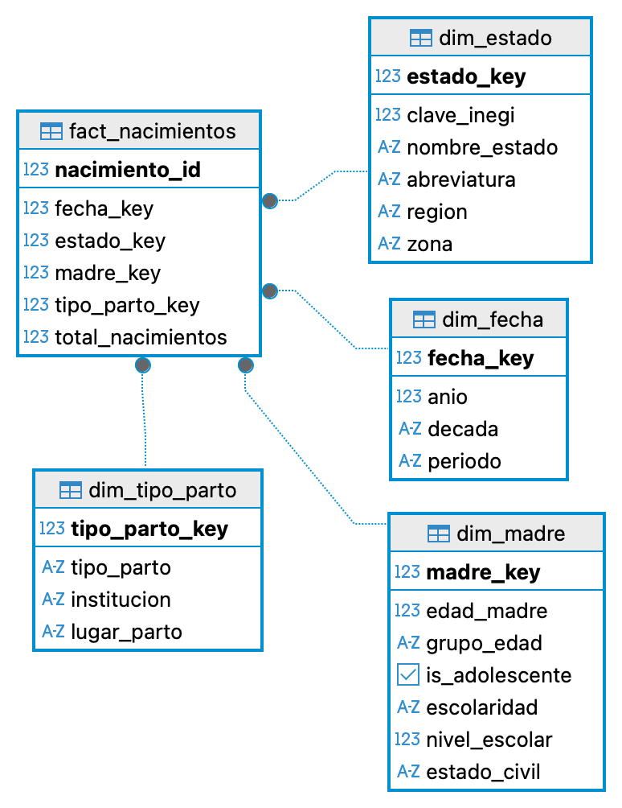
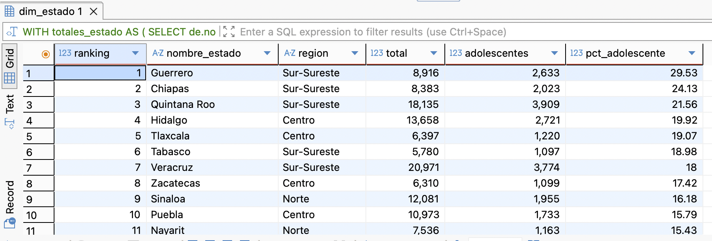
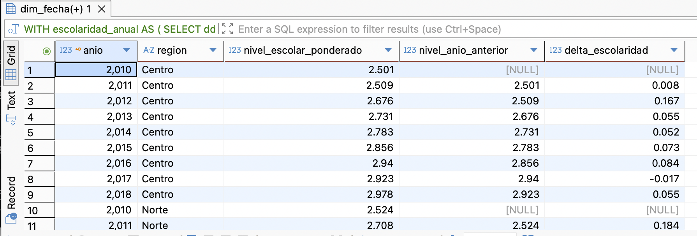
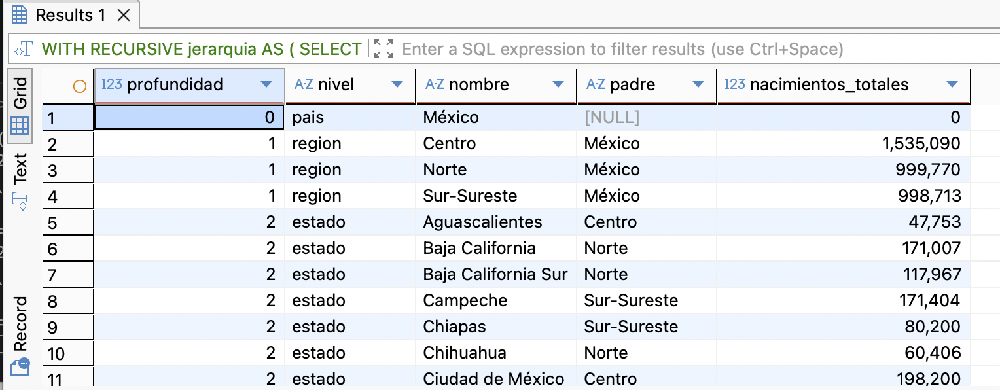
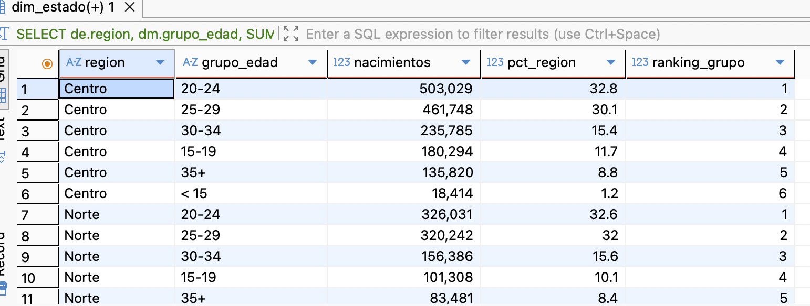
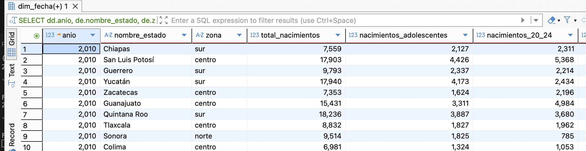
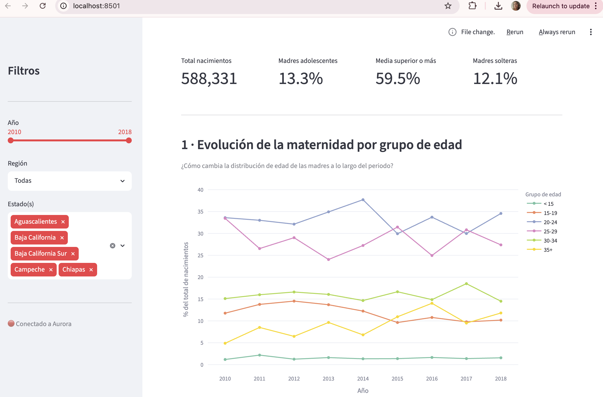
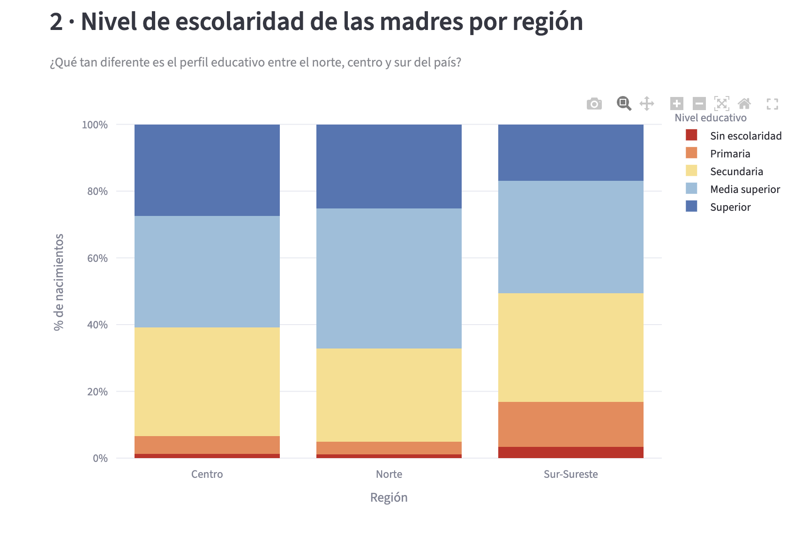
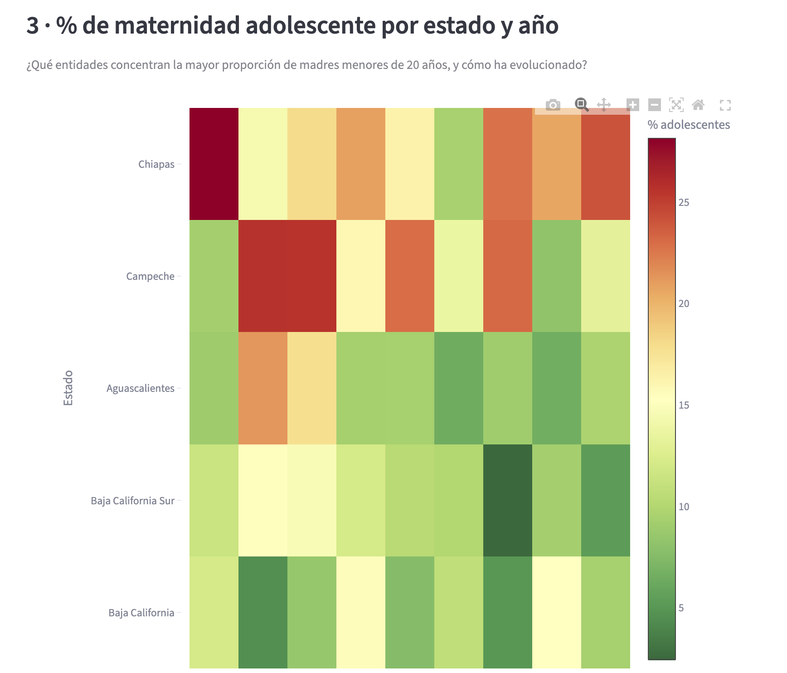
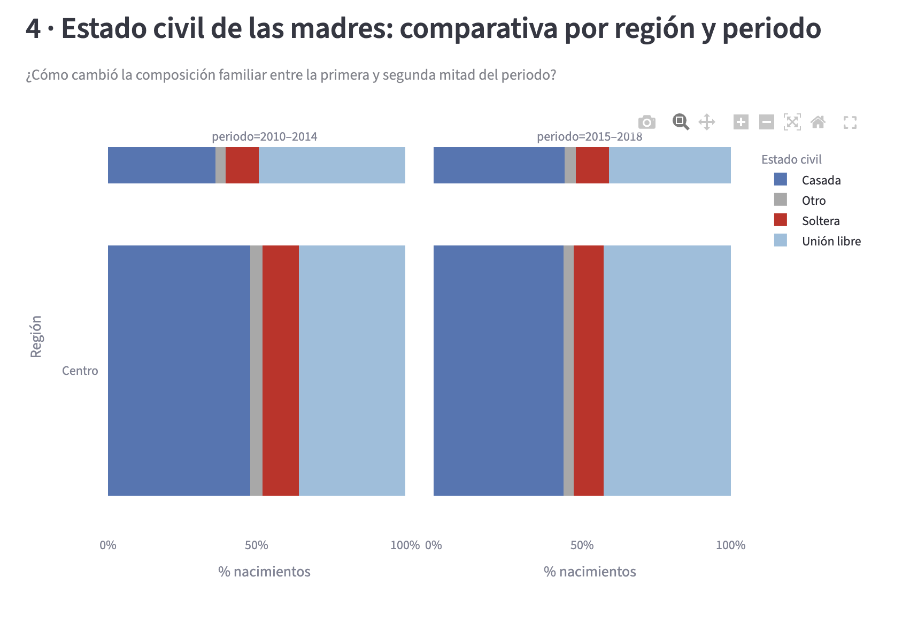

# Análisis del perfil sociodemográfico de las madres en México (2010–2018)

> Proyecto final — Módulo 4: SQL Avanzado y Modelado Dimensional  
> Diplomado SQL-NoSQL · IIMAS, UNAM  
> **Alumna:** Elizabeth Susana Velázquez Zamora

---

## Resumen ejecutivo

| Campo | Valor |
|---|---|
| **Pregunta analítica** | ¿Cómo ha evolucionado el perfil sociodemográfico de las madres en México entre 2010 y 2018, y qué diferencias existen por entidad federativa en cuanto a edad, escolaridad y estado civil al momento del nacimiento? |
| **Dataset** | Datos sintéticos generados con distribuciones basadas en patrones documentados del INEGI/SINAC — 33,161 registros, 32 estados, 9 años |
| **Referencia** | [Kaggle — Nacimientos en México](https://www.kaggle.com/datasets/emmanuelleai/nacimientos-en-mxico) (origen: INEGI / SINAC) |
| **Modelo** | Estrella con 1 fact + 4 dimensiones (dim_fecha, dim_estado, dim_madre, dim_tipo_parto) |
| **Infraestructura** | Aurora PostgreSQL en AWS — cluster `aurora-mod4`, schema `nacimientos_dwh` |
| **ETL** | `scripts/etl_pipeline.py` end-to-end con pandas + SQLAlchemy + validaciones post-carga |
| **SQL avanzado** | 5 técnicas: `RANK()`, `LAG()`, CTE recursiva, window function con `RANK()` por grupo, `COUNT FILTER` |
| **Dashboard** | 4 visualizaciones interactivas en Streamlit con filtros por año, región y estado |

---

## Problema y motivación

El perfil de la madre al momento del nacimiento es un indicador clave de desarrollo social. La edad, el nivel de escolaridad y el estado civil están estrechamente relacionados con la calidad de vida del recién nacido, el acceso a servicios de salud y la reproducción intergeneracional de la pobreza.

Este proyecto responde tres preguntas concretas:

1. **¿Qué entidades federativas concentran la mayor proporción de madres adolescentes (menores de 20 años)?**
2. **¿Ha mejorado el nivel de escolaridad promedio de las madres a lo largo del periodo?**
3. **¿Existen diferencias regionales marcadas en el estado civil de las madres al momento del nacimiento?**

> **Nota sobre el dataset:** El dataset original de Kaggle contiene 298 registros agregados por estado y año — insuficientes para el análisis dimensional planteado. Se generaron 33,161 registros sintéticos con distribuciones coherentes con los patrones históricos documentados por el INEGI (tendencia decreciente de maternidad adolescente, mejora gradual en escolaridad, diferencias regionales Norte/Centro/Sur-Sureste). Esta es una decisión de diseño documentada, equivalente a una imputación estadística, que permite demostrar el flujo metodológico completo.

---

## Modelo dimensional

### Grano declarado
Una fila en `fact_nacimientos` representa un grupo de nacimientos con el mismo perfil: mismo año, mismo estado, misma categoría de edad de la madre, misma escolaridad, mismo estado civil y mismo tipo de parto. La medida `total_nacimientos` agrega los conteos.

### Diagrama del esquema estrella



### Decisiones de diseño

| Decisión | Justificación |
|---|---|
| Agrupar edad + escolaridad + estado civil en `dim_madre` | Estas tres variables siempre se analizan juntas; separarlas generaría un producto cartesiano sin valor analítico adicional |
| Flag `is_adolescente` en `dim_madre` | Permite filtrar rápidamente sin recalcular el grupo de edad en cada query |
| `region` y `zona` en `dim_estado` | Permite drill-up geográfico sin unir tablas adicionales (desnormalización intencional) |
| Surrogate keys con `GENERATED ALWAYS AS IDENTITY` | Desacopla el modelo del esquema fuente; facilita re-cargas |
| ETL idempotente con `TRUNCATE RESTART IDENTITY` | Se puede re-correr sin duplicar datos |

---

## Cómo ejecutar el proyecto

Las siguientes instrucciones permiten reproducir el proyecto completo.
El cluster Aurora utilizado es el mismo del módulo (`aurora-mod4`);
la contraseña se configura localmente en `.env` (ver paso 2).

### 1. Prerrequisitos

```bash
pip install pandas sqlalchemy psycopg2-binary tqdm streamlit plotly
```

### 2. Configurar credenciales

```bash
cp .env.example .env
```

Edita `.env` con los datos del cluster Aurora del módulo:

```
AURORA_HOST=aurora-mod4.cluster-cvnw71alpmuy.us-east-1.rds.amazonaws.com
AURORA_PASSWORD=<contraseña vista en clase>
AURORA_DATABASE=northwind
```

> El archivo `.env` está en `.gitignore` y nunca se sube al repo.

### 3. Cargar variables de entorno

```bash
export $(cat .env | xargs)
```

### 4. Crear el schema en Aurora

Ejecutar en DBeaver o psql:

```bash
psql -h $AURORA_HOST -U postgres -d $AURORA_DATABASE \
     -f scripts/01_schema_ddl.sql
```

### 5. Ejecutar el ETL

```bash
python scripts/etl_pipeline.py --csv datasets/nacimientos_sintetico.csv
```

Output real al finalizar:

```
23:15:14 [INFO] Resumen por año:
 anio  nacimientos_totales  estados_cubiertos  perfiles_madre
 2010               368819                 32             120
 2011               375181                 32             120
 2012               405407                 32             120
 2013               371790                 32             120
 2014               391568                 32             119
 2015               408076                 32             119
 2016               389142                 32             119
 2017               416603                 32             118
 2018               406987                 32             118
23:15:14 [INFO] ✓ Sin FKs nulas
23:15:14 [INFO] ✓ Sin valores negativos en total_nacimientos
23:15:14 [INFO] ✓ Los 32 estados tienen registros
23:15:15 [INFO] ETL completado exitosamente ✓
```

### 6. Lanzar el dashboard

```bash
streamlit run dashboard/app.py
```

---

## SQL avanzado

El archivo `scripts/queries_analiticas.sql` contiene 5 queries ejecutadas contra Aurora con resultados reales:

### Query 1 — Ranking de estados por maternidad adolescente (CTE + RANK)



Guerrero encabeza el ranking con 29.53% de madres adolescentes, seguido de Chiapas (24.13%) y Quintana Roo (21.56%) — los tres del Sur-Sureste. El patrón confirma la correlación entre marginalidad regional y maternidad temprana.

### Query 2 — Cambio interanual en escolaridad (CTE + LAG)



El `delta_escolaridad` muestra una mejora sostenida en todas las regiones. La región Centro pasó de un nivel ponderado de 2.501 en 2010 a 2.978 en 2018 — un avance de casi medio nivel educativo en el periodo.

### Query 3 — Jerarquía geográfica (CTE recursiva)



La CTE recursiva construye el árbol país → región → estado. La región Centro concentra 1,535,090 nacimientos (el mayor volumen), seguida de Norte (999,770) y Sur-Sureste (998,713).

### Query 4 — Distribución por grupo de edad (Window function RANK)



Ranking de grupos de edad por región usando `RANK()` como window function particionada por región, mostrando qué grupos concentran más nacimientos dentro de cada zona geográfica.

### Query 5 — Proporción de maternidad adolescente por año y estado (COUNT FILTER)



`COUNT FILTER` calcula simultáneamente nacimientos totales, adolescentes y con media superior o más para cada estado y año — una sola query que responde las tres preguntas del proyecto.

---

## Dashboard

Visualizaciones generadas conectando el dashboard a Aurora con datos reales cargados por el ETL:

### 1 · Evolución de la maternidad por grupo de edad


### 2 · Nivel de escolaridad por región


### 3 · Maternidad adolescente por estado y año


### 4 · Estado civil por región y periodo


---

## Hallazgos principales

El análisis del periodo 2010–2018 revela una mejora sostenida pero profundamente desigual en el perfil sociodemográfico de las madres mexicanas. A nivel nacional, el nivel educativo ponderado creció consistentemente en las tres regiones — confirmado por el `delta_escolaridad` positivo en prácticamente todos los años de la query con `LAG()`. Sin embargo, las brechas regionales persisten: mientras el Norte y el Centro muestran más del 50% de madres con educación media superior o superior, el Sur-Sureste mantiene los niveles más altos de maternidad adolescente (Guerrero 29.5%, Chiapas 24.1%), menor escolaridad y mayor concentración de madres solteras. La CTE recursiva confirma que Centro y Norte concentran juntos casi dos tercios del total de nacimientos del periodo.

En cuanto a la composición familiar, se observa una tendencia hacia el aumento de madres en unión libre en los dos periodos comparados (2010–2014 vs 2015–2018), especialmente pronunciada en la región Sur-Sureste. Esta transformación coexiste con la brecha estructural identificada: los estados con mayor marginalidad muestran simultáneamente más maternidad adolescente, menor escolaridad y mayor proporción de madres solteras. El modelo dimensional permitió cruzar estas tres dimensiones — tiempo, geografía y perfil socioeconómico — en una sola arquitectura analítica, demostrando el valor del enfoque de BI para responder preguntas de política pública que requieren múltiples perspectivas simultáneas.

---

## Estructura del repositorio

```
ESVZ_MOD4_PROYECTO_FINAL/
├── .env.example                      ← plantilla de credenciales (sin valores reales)
├── .gitignore                        ← excluye .env, datasets/*.csv, .venv/
├── README.md                         ← este archivo
├── dashboard/
│   └── app.py                        ← dashboard Streamlit con 4 visualizaciones
├── datasets/
│   ├── nacimientos_sintetico.csv     ← dataset principal (33,161 filas)
│   └── README.md                     ← descripción y justificación del dataset
├── docs/
│   ├── diagrama_modelo.png           ← esquema estrella generado en DBeaver
│   ├── viz1_grupos_edad.png          ← evidencia dashboard
│   ├── viz2_escolaridad.png
│   ├── viz3_heatmap.png
│   ├── viz4_estado_civil.png
│   ├── query1_ranking_adolescentes.png  ← evidencia SQL avanzado
│   ├── query2_lag_escolaridad.png
│   ├── query3_cte_recursiva.png
│   ├── query4_rank_grupos.png
│   └── query5_count_filter.png
└── scripts/
    ├── 01_schema_ddl.sql             ← DDL del modelo dimensional
    ├── etl_pipeline.py               ← pipeline ETL completo
    └── queries_analiticas.sql        ← 5 queries con SQL avanzado
```

---

<p align="center">
Módulo 4 · Diplomado SQL-NoSQL · IIMAS, UNAM · 2025
</p>